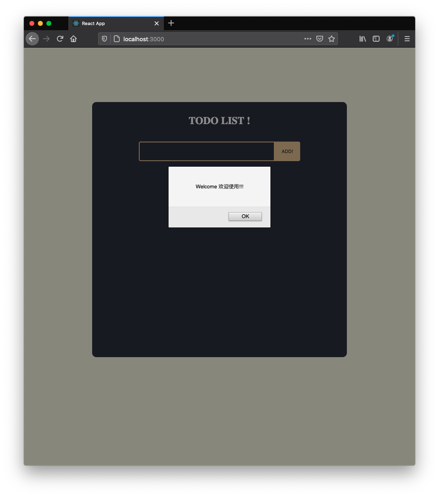
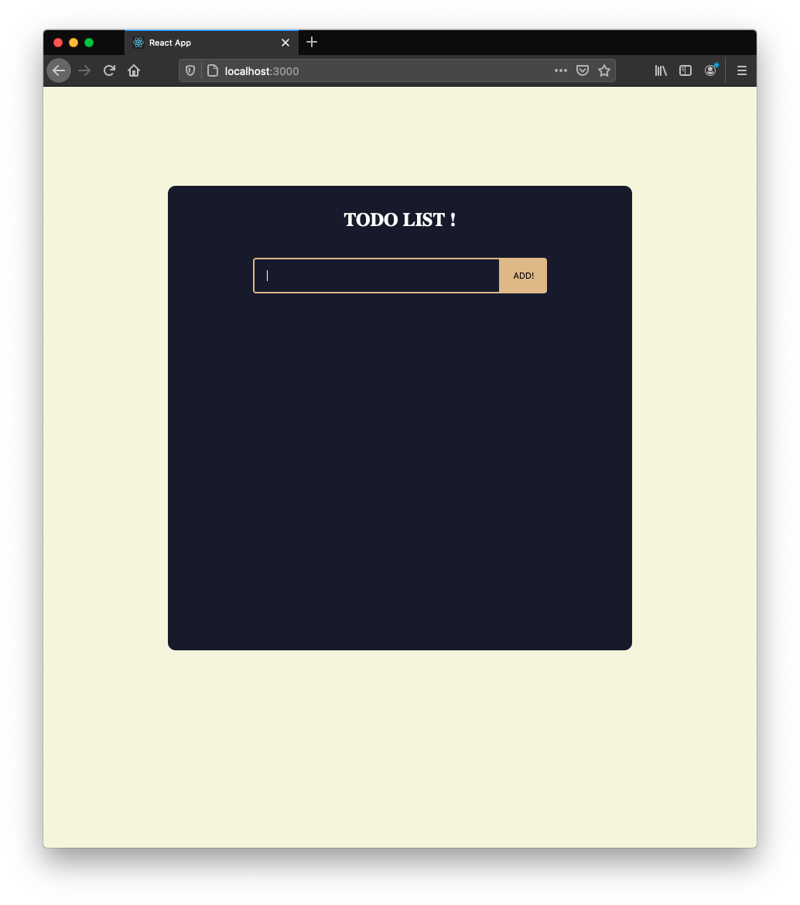
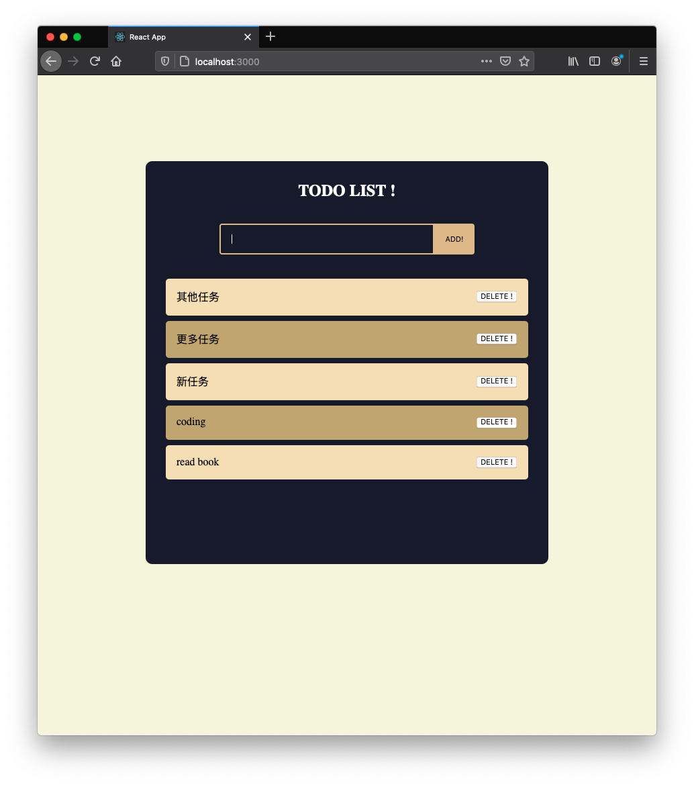
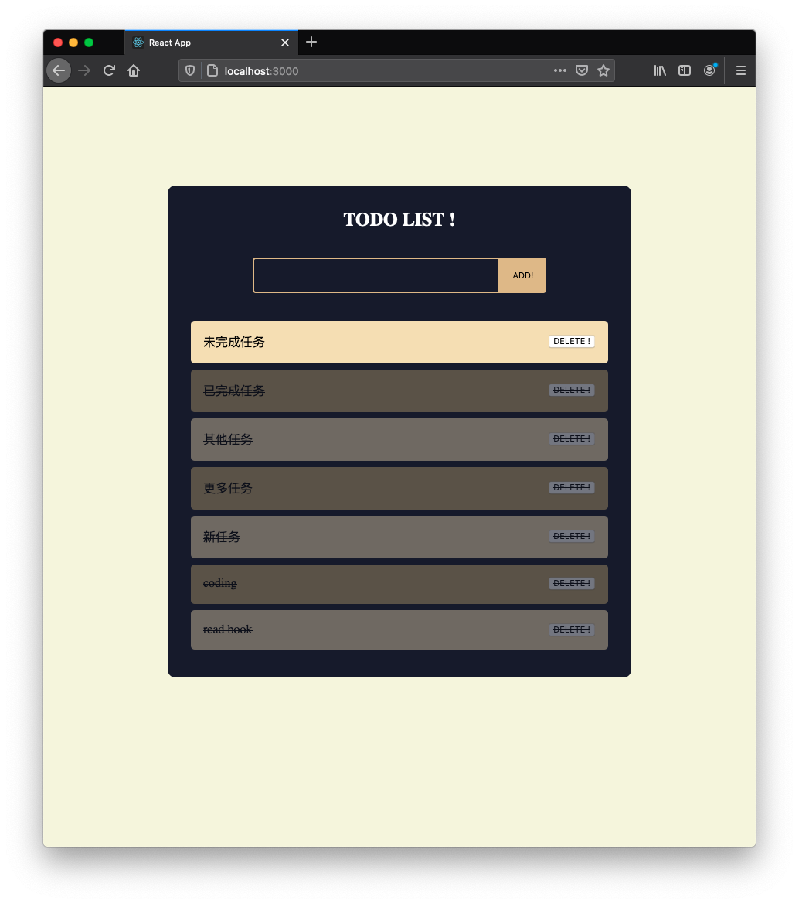
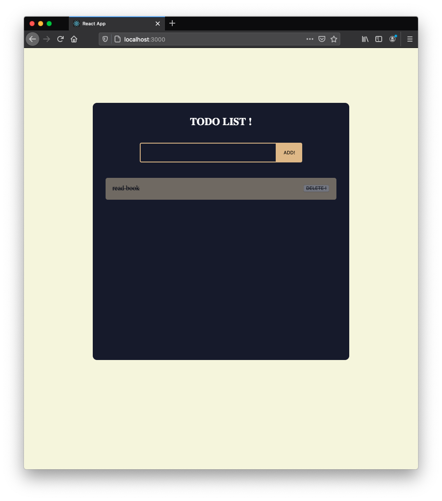

# TODO list 任务清单 

> 使用 React 搭建简易TODO list APP


本项目使用了create-react-app脚手架，CSS Flex进行页面布局， 并使用 useState Hook 以及 useEffect Hook实现添加 /完成 / 删除任务。

## 内容列表

- [Getting Started 使用指南](#GettingStarted使用指南)

- [Release History 版本历史](#ReleaseHistory版本历史)

- [Author 关于作者](#Author关于作者)

- [License 授权协议](#License授权协议)


## GettingStarted使用指南

### 项目运行

```
npm install 

npm start 
```

### 使用说明
欢迎界面

在输入框输入任务

添加任务

点击任务将任务变为已完成状态

点击 DELETE！键



## ReleaseHistory版本历史

* 0.1.0

## Author关于作者

* **BX** - *Initial work* - [BX](https://github.com/BX126)

## License授权协议

[MIT LICENSE](LICENSE) @ BX